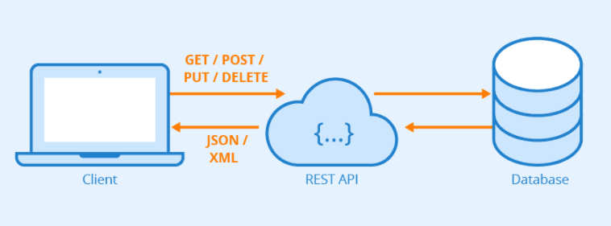
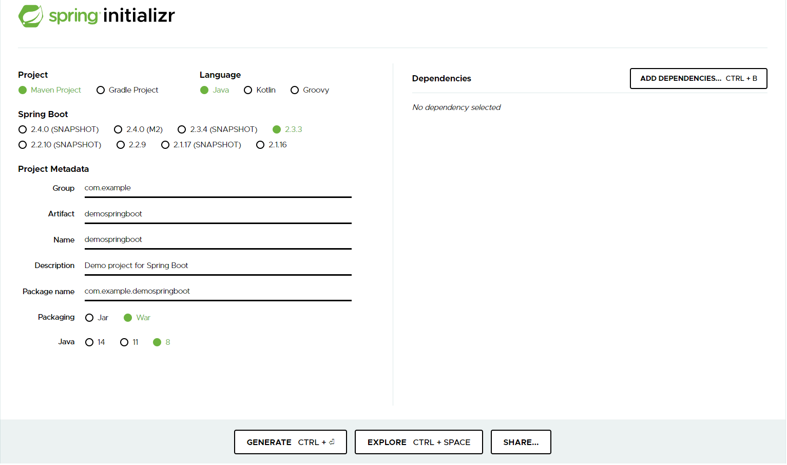
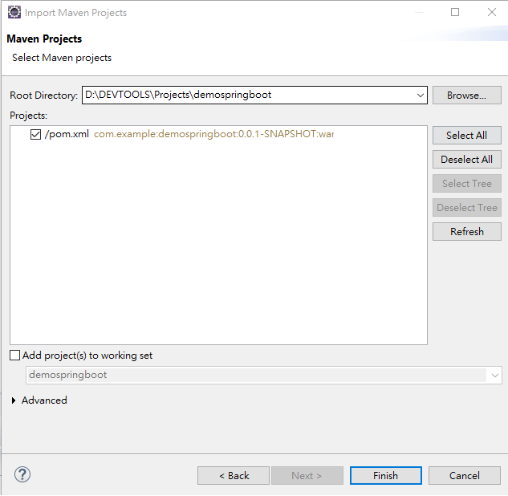
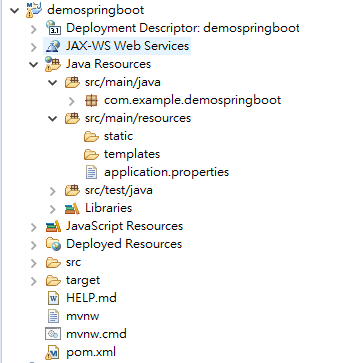

# 1. 建立Spring Boot

## 在開始之前......

在開始之前，先來談談 Spring Boot 是什麼 ? 網路上應該會查到很多他的特性，像是 IoC、AOP......，這些東西會在後面的部分提到，不過先看看在行內，通常會拿它來做什麼，最常見的就是 REST 服務 :



先不論內部架構該怎麼寫，這張示意圖呈現了 REST 服務通常會做的事情，圖中左邊有個 client 客戶端，它會利用自己的 ID，拿到此 ID 對應的帳戶資料，想像一下打開國泰世華銀行的 APP，登入後會看到自己的帳戶餘額，以及各種繳款紀錄，這些紀錄就是這樣來的 !!! 銀行 APP 透過 REST 服務拿到資料庫資料，REST 服務擔任了客戶端與資料庫之間的銜接橋梁。

這個 REST 服務除了給 APP 使用外，也擔任其他入口管道的橋樑，只要想拿到一樣的資料，基本上就可以透過這個已經做好的服務來完成。

## 建立空專案

到 spring initializr 點選以下選項，產生空專案:



在 eclipse 匯入此專案，點選 File->Import->Maven->Existing Maven Projects :



匯入後會出現這樣的專案架構:



執行 `DemospringbootApplication.java` ，此時 console 會有下面的畫面:


基本上這樣就啟好 Spring Boot 專案了，在網址列上輸入 localhost:8080，會有這樣的結果:


## 建立Hello World

先建立 `controller package` : 

``` 

|--com.example.demospringboot
   |--DemospringbootApplication.java 
|--com.example.demospringboot.controller
   |--TestController.java // 新增的檔案
```

在 `TestController.java` 寫出以下程式碼:

``` java
@Controller
public class TestController {
    @RequestMapping("/")
    @ResponseBody
    public String hello() {
       return "Hello Spring Boot";
    }
}
```

重啟 Spring Boot 專案，在網址列打上 `localhost:8080` 可拿到這段 Hello Spring Boot 字串。

## Maven

Maven 是一個專案管理工具，在 Spring Boot 專案中，可看到名為 `pom.xml` 的檔案，來看看裡面的檔案內容:

``` xml
<?xml version="1.0" encoding="UTF-8"?>
<project xmlns="http://maven.apache.org/POM/4.0.0" xmlns:xsi="http://www.w3.org/2001/XMLSchema-instance"
	xsi:schemaLocation="http://maven.apache.org/POM/4.0.0 https://maven.apache.org/xsd/maven-4.0.0.xsd">
	<modelVersion>4.0.0</modelVersion>
	<parent>
		<groupId>org.springframework.boot</groupId>
		<artifactId>spring-boot-starter-parent</artifactId>
		<version>2.3.3.RELEASE</version>
		<relativePath/> <!-- lookup parent from repository -->
	</parent>
	<groupId>com.example</groupId>
	<artifactId>demospringboot</artifactId>
	<version>0.0.1-SNAPSHOT</version>
	<packaging>war</packaging>
	<name>demospringboot</name>
	<description>Demo project for Spring Boot</description>

	<properties>
		<java.version>1.8</java.version>
	</properties>

	<dependencies>
		<dependency>
			<groupId>org.springframework.boot</groupId>
			<artifactId>spring-boot-starter-web</artifactId>
		</dependency>

		<dependency>
			<groupId>org.springframework.boot</groupId>
			<artifactId>spring-boot-starter-tomcat</artifactId>
			<scope>provided</scope>
		</dependency>
		<dependency>
			<groupId>org.springframework.boot</groupId>
			<artifactId>spring-boot-starter-test</artifactId>
			<scope>test</scope>
			<exclusions>
				<exclusion>
					<groupId>org.junit.vintage</groupId>
					<artifactId>junit-vintage-engine</artifactId>
				</exclusion>
			</exclusions>
		</dependency>
	</dependencies>

	<build>
		<plugins>
			<plugin>
				<groupId>org.springframework.boot</groupId>
				<artifactId>spring-boot-maven-plugin</artifactId>
			</plugin>
		</plugins>
	</build>

</project>
```

首先是 `<parent>` ，按住 Ctrl 點擊裡面的 `<groupId>org.springframework.boot</groupId>` 後，可看到 Spring Boot 一開始放在專案內的東西，這部分稍微知道即可，不必著墨太多。下面的 `<dependencies>` 則是額外加入專案要使用的檔案，像是這段 `<dependency>` :

``` xml
<dependency>
    <groupId>org.springframework.boot</groupId>
    <artifactId>spring-boot-starter-tomcat</artifactId>
    <scope>provided</scope>
</dependency>
```

這段 `<dependency>` 幫忙將 server 内嵌在 Spring Boot 內 ( 關鍵字: embedded server )，這也是為什麼 Spring Boot 啟用 web 服務時，跟使用傳統的 JavaEE 不太一樣，直接執行 Java 中的 `main` 方法就可將整個服務給帶起來。除了 tomcat 之外，還有好幾種 Spring Boot 裡有的 server ，可自行上網查詢怎麼去更改。

如果有想要使用的 jar 檔，大多都能在網路上查到它的 `<dependency>` ，只要在 `pom.xml` 中加入它，就可直接使用，這邊先加入一段 `<dependency>` ，這樣在更改專案內容時，不用重新啟動 Spring Boot 就會自動 deploy ( hot deploy )。

``` xml
<!-- 開發用 -->
<dependency>
	<groupId>org.springframework.boot</groupId>
	<artifactId>spring-boot-devtools</artifactId>
	<scope>runtime</scope>
</dependency>
```

## 參考

https://start.spring.io/
